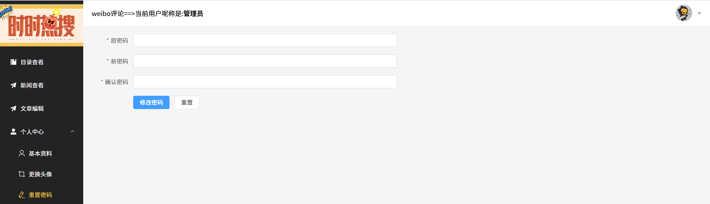

# Weibo-comment-platform 大众点评

基于 Spring Boot + Vue 3 的大众评论，使用redis+nginx的分布式系统，提供用户认证、文章管理、分类管理、优惠券秒杀核心功能。

------


# 后端说明

## 一、用户管理模块

### 需求阶段

**需求背景**：项目需要一个完整的用户系统，支持注册、登录、信息修改、头像上传等基本功能。

**痛点**：

- 传统Session认证在分布式环境下不好扩展
- 密码明文存储不安全
- 用户头像上传需要支持本地和云端（阿里云OSS）

### 设计阶段

**设计思路**：

Q：为什么不用Session而用JWT？
> A：Session需要在服务端维护会话状态，集群部署时需要Session共享（Redis），但每次请求都要查Redis。JWT是无状态的，Token本身携带用户信息，服务端只需要验证签名即可，更适合分布式架构。

Q：为什么密码要用MD5加密？
> A：MD5是单向哈希算法，无法逆向解密，且生成的哈希值长度固定（32位），便于存储。虽然MD5存在碰撞风险，但对于普通项目已经足够安全，且Spring内置的DigestUtils使用方便。

**架构设计**：
```
用户请求 → LoginInterceptor → JwtUtil校验Token → Controller → Service → Mapper → MySQL
                      ↓
        Redis（存储Token、验证码）
```

### 编码阶段

**核心代码实现**：

```java
// UserController.java - 登录逻辑
@PostMapping("/login")
public Result login(String userName, String password){
    // 1. 验证用户（MD5密码匹配）
    User user = userService.matchUser(userName, password);
    
    // 2. 构建Token载荷
    Map<String,Object> map = new HashMap<>();
    map.put(JwtConstant.ID, user.getId());
    map.put(JwtConstant.NAME, user.getUserName());
    ThreadLocalContextHolder.set(map);
    
    // 3. 生成Token
    String token = JwtUtil.createJWT(jwtProperties.getSecretKey(), jwtProperties.getTtlMillis(), map);
    
    // 4. 存入Redis
    stringRedisTemplate.opsForValue().set(
        "bigevent:" + user.getId(), 
        token, 
        jwtProperties.getTtlMillis(), 
        TimeUnit.SECONDS
    );
    
    return Result.success(token);
}
```

```java
// UserServiceImpl.java - 用户校验
@Override
public User matchUser(String userName, String password) {
    // MD5加密密码后比对
    password = DigestUtils.md5DigestAsHex(password.getBytes());
    LambdaQueryWrapper<User> queryWrapper = new LambdaQueryWrapper<>();
    queryWrapper.eq(User::getUserName, userName)
            .eq(User::getPassword, password);
    User checkUser = this.getOne(queryWrapper);
    if (checkUser == null) {
        throw new RuntimeException("用户名或密码错误");
    }
    return checkUser;
}
```

### 问题修复阶段

**问题1**：Token过期时间固定，用户活跃时Token也会过期

**修复方案**：实现滑动过期策略，在ReLoginInterceptor中每次请求时刷新Redis中Token的有效期

```java
// ReLoginInterceptor.java
@Override
public boolean preHandle(HttpServletRequest request, HttpServletResponse response, Object handler) throws Exception {
    String token = request.getHeader("Authorization");
    Map<String, Object> claims = JwtUtil.parseJWT(jwtProperties.getSecretKey(), token);
    String currentId = claims.get(JwtConstant.ID).toString();
    Long id = Long.parseLong(currentId);
    
    // 验证Token是否与Redis中存储的一致
    String standard_token = stringRedisTemplate.opsForValue().get("bigevent:" + id);
    if (!standard_token.equals(token)) {
        response.setStatus(HttpServletResponse.SC_UNAUTHORIZED);
        return false;
    }
    
    // 刷新Token有效期（滑动过期策略）
    stringRedisTemplate.expire("bigevent:" + id, jwtProperties.getTtlMillis(), TimeUnit.SECONDS);
    
    // 将用户信息存入ThreadLocalContextHolder
    ThreadLocalContextHolder.set(claims);
    return true;
}
```

**问题2**：头像上传到本地后，部署到服务器路径不对

**修复方案**：集成阿里云OSS，上传到云端并返回CDN访问URL

---

## 二、文章管理模块

###  需求阶段

**需求背景**：需要支持文章的CRUD操作，文章量较大时需要缓存优化。

**痛点**：
- 文章列表查询慢
- 热点文章访问压力大
- 缓存与数据库一致性问题

###  设计阶段

**设计思路**：

Q：为什么用逻辑过期而不是物理过期？
> A：物理过期的话，缓存过期瞬间会有大量请求穿透到数据库（缓存击穿）。逻辑过期是缓存永不过期，但在数据中记录过期时间，过期后通过分布式锁让一个线程去更新缓存，其他线程返回旧数据，这样不会导致数据库压力骤增。

Q：为什么不直接用@Cacheable注解？
> A：@Cacheable是Spring提供的声明式缓存，虽然方便但不够灵活。比如需要自定义缓存策略、分布式锁控制、逻辑过期等场景，手动控制Redis操作更合适。

**缓存策略流程图**：
```
查询文章
    ↓
缓存存在？
    ├─ 是 → 检查逻辑过期？
    │         ├─ 未过期 → 直接返回缓存数据
    │         └─ 已过期 → 获取分布式锁
    │                     ├─ 获取成功 → 查询数据库 → 更新缓存 → 返回新数据
    │                     └─ 获取失败 → 返回旧缓存数据
    └─ 否 → 查询数据库 → 设置缓存（逻辑过期时间）→ 返回数据
```

### 编码阶段

**核心代码实现**：

```java
// ArticleServiceImpl.java - 带缓存的查询
@Override
public Article readCache(Long id) {
    // 调用逻辑过期缓存策略
    return logicCache(id);
}

private Article logicCache(Long id){
    String key = KEYS + id;
    // 1. 从缓存中获取数据
    String value = stringRedisTemplate.opsForValue().get(key);
    
    // 2.1 缓存中没有数据
    if(StrUtil.isBlank(value)){
        Article article = super.getById(id);
        RedisData redisData = new RedisData();
        if (article == null) {
            // 空值也缓存，防止缓存穿透
            redisData.setData(null);
            redisData.setExpireTime(LocalDateTime.now().plusSeconds(10));
            stringRedisTemplate.opsForValue().set(key, JSONUtil.toJsonStr(redisData));
            throw new RuntimeException("id不存在");
        }
        // 设置逻辑过期时间10秒
        redisData.setData(article);
        redisData.setExpireTime(LocalDateTime.now().plusSeconds(10));
        stringRedisTemplate.opsForValue().set(key, JSONUtil.toJsonStr(redisData));
        return article;
    }
    
    // 2.2 缓存中存在数据，检查逻辑过期
    RedisData redisData = JSONUtil.toBean(value, RedisData.class);
    if (redisData.getExpireTime().isBefore(LocalDateTime.now())) {
        log.info("缓存出现过期");
        // 获取分布式锁更新缓存
        Boolean success = cacheLock();
        if(success) {
            try {
                Article article = super.getById(id);
                redisData.setExpireTime(LocalDateTime.now().plusSeconds(10));
                redisData.setData(article);
                stringRedisTemplate.opsForValue().set(key, JSONUtil.toJsonStr(redisData));
            } finally {
                cacheUnlock();
            }
        }
    }
    // 返回缓存数据
    return BeanUtil.toBean(redisData.getData(), Article.class);
}
```

### 问题修复阶段

**问题**：缓存击穿问题 - 热点文章缓存过期瞬间，大量请求同时穿透到数据库

**修复方案**：使用分布式锁（RedisLock）+ 逻辑过期策略

---

## 三、分类管理模块

### 需求阶段

**需求背景**：文章需要分类管理，支持分类的增删改查，分类数据相对稳定但访问频繁。

**痛点**：
- 分类数量较少但查询频率高
- 需要与文章模块共享缓存策略
- 分类修改后需要及时同步到缓存

### 设计阶段

**设计思路**：

Q：为什么复用文章模块的缓存策略？
> A：分类数据和文章数据的缓存需求相似——都是读多写少、需要防止缓存击穿。复用相同的逻辑过期+分布式锁策略可以减少代码重复，提高可维护性。

Q：分类和文章的缓存策略有什么差异？
> A：分类数据量更小（通常几十到几百个），缓存命中率更高，可以设置更长的逻辑过期时间。而文章数据量大，需要更频繁地更新缓存。

**架构设计**：
```
查询分类
    ↓
缓存存在？
    ├─ 是 → 检查逻辑过期？
    │         ├─ 未过期 → 直接返回缓存数据
    │         └─ 已过期 → 获取分布式锁更新缓存
    └─ 否 → 查询数据库 → 设置缓存（逻辑过期时间）→ 返回数据
```

### 编码阶段

**核心代码实现**：

```java
// CategoryServiceImpl.java - 带缓存的查询
@Override
public Category readCache(Long id) {
    return logicCache(id);
}

private Category logicCache(Long id){
    String key = KEYS + id;
    String value = stringRedisTemplate.opsForValue().get(key);
    
    if(StrUtil.isBlank(value)){
        Category category = super.getById(id);
        RedisData redisData = new RedisData();
        if (category == null) {
            redisData.setData(null);
            redisData.setExpireTime(LocalDateTime.now().plusSeconds(10));
            stringRedisTemplate.opsForValue().set(key, JSONUtil.toJsonStr(redisData));
            throw new RuntimeException("分类不存在");
        }
        redisData.setData(category);
        redisData.setExpireTime(LocalDateTime.now().plusSeconds(10));
        stringRedisTemplate.opsForValue().set(key, JSONUtil.toJsonStr(redisData));
        return category;
    }
    
    RedisData redisData = JSONUtil.toBean(value, RedisData.class);
    if (redisData.getExpireTime().isBefore(LocalDateTime.now())) {
        Boolean success = cacheLock();
        if(success) {
            try {
                Category category = super.getById(id);
                redisData.setExpireTime(LocalDateTime.now().plusSeconds(10));
                redisData.setData(category);
                stringRedisTemplate.opsForValue().set(key, JSONUtil.toJsonStr(redisData));
            } finally {
                cacheUnlock();
            }
        }
    }
    return BeanUtil.toBean(redisData.getData(), Category.class);
}
```

### 问题修复阶段

**问题**：分类修改后，文章页面显示的分类名称没有更新

**修复方案**：在分类更新/删除时主动删除缓存，确保下次查询时从数据库获取最新数据

```java
@Override
public Boolean updateCache(Category category) {
    String key = KEYS + category.getId();
    boolean result = super.updateById(category);
    stringRedisTemplate.delete(key);  // 删除缓存
    return result;
}
```

---

## 四、探店博文模块

### 需求阶段

**需求背景**：实现探店笔记功能，支持用户发布探店博文、点赞互动等社交功能。

**痛点**：
- 点赞操作并发冲突问题
- 点赞状态需要实时查询
- 热点笔记点赞数统计压力大

### 设计阶段

**设计思路**：

Q：为什么点赞用Redis的ZSet而不是普通Set？
> A：ZSet可以存储分数（timestamp），这样可以按点赞时间排序，方便获取热门点赞用户。同时ZSet的score操作是原子的，不会出现并发问题。

Q：为什么点赞数同时存Redis和MySQL？
> A：Redis用于实时查询和计数，MySQL用于持久化存储。点赞操作先更新MySQL再更新Redis，保证数据最终一致性。

**架构设计**：
```
点赞请求 → BlogController → BlogServiceImpl（更新MySQL点赞数）→ Redis ZSet记录点赞用户
查询点赞状态 → Redis ZSet（score判断是否存在）
查询热门点赞 → Redis ZSet range获取Top N
```

### 编码阶段

**核心代码实现**：

```java
// BlogController.java - 点赞功能
@PostMapping("/liked/{id}")
public Result isliked(@PathVariable Long id) {
    Long userId = ThreadLocalParam.getUserId();
    String key = "blog:liked:" + id;
    Double liked = stringRedisTemplate.opsForZSet().score(key, userId.toString());
    
    if (liked == null) {
        // 用户未点赞，执行点赞操作
        boolean success = blogService.lambdaUpdate()
                .setSql("liked= liked + 1").eq(Blog::getId, id).update();
        if (success) {
            stringRedisTemplate.opsForZSet().add(key, userId.toString(), System.currentTimeMillis());
        }
        return Result.success("liked::" + id);
    } else {
        // 用户已点赞，取消点赞
        boolean success = blogService.lambdaUpdate()
                .setSql("liked= liked - 1").eq(Blog::getId, id).update();
        if (success) {
            stringRedisTemplate.opsForZSet().remove(key, userId.toString());
        }
        return Result.success("unliked::" + id);
    }
}
```

```java
// BlogController.java - 获取热门点赞用户
@GetMapping("/liked/hot")
public Result likedHot(@PathParam("id") long id) {
    String key = "blog:liked:" + id;
    // 获取点赞数最多的前3个用户
    Set<String> set = stringRedisTemplate.opsForZSet().range(key, 0, 2);
    List<Long> ids = set.stream().map(s -> Long.parseLong(s)).toList();
    List<User> userList = userService.listByIds(ids);
    return Result.success(userList);
}
```

### 问题修复阶段

**问题**：点赞操作在高并发下可能出现计数不准确

**修复方案**：MySQL使用原子操作 `setSql("liked= liked + 1")`，Redis使用ZSet的原子add/remove操作，保证计数一致性。

---

## 五、评论与回复模块

### 需求阶段

**需求背景**：实现评论功能，支持对探店笔记的评论和回复，支持多级回复。

**痛点**：
- 评论数据量大，查询性能要求高
- 需要支持评论的点赞和举报功能
- 评论与回复的层级关系需要清晰

### 设计阶段

**设计思路**：

Q：为什么用parent_id区分评论和回复？
> A：`parent_id = 0` 表示直接评论博文，`parent_id = 1` 表示回复其他评论。这种设计可以支持无限层级的回复，同时查询时可以通过parent_id区分评论和回复。

Q：评论表为什么需要answer_id字段？
> A：`answer_id` 记录回复目标评论的ID，用于构建评论的回复链，方便前端展示回复关系。

**架构设计**：
```
评论请求 → BlogCommentsController → BlogCommentsServiceImpl → MySQL（blog_comments表）
查询评论列表 → BlogCommentsServiceImpl → MySQL（按blog_id查询，支持分页）
回复评论 → 设置parent_id=1，answer_id=目标评论ID
```

### 编码阶段

**核心代码实现**：

```java
// BlogCommentsController.java - 评论控制器
@RestController
@RequestMapping("/comments")
public class BlogCommentsController {
    @Autowired
    private BlogCommentsService blogCommentsService;
    @Autowired
    private BlogService blogService;
    
    // 评论功能待实现，当前框架已搭建
}
```

### 问题修复阶段

**问题**：评论状态管理（正常、被举报、禁止查看）

**修复方案**：在blog_comments表中设置status字段，0表示正常，1表示被举报，2表示禁止查看。查询时过滤掉status=2的评论。

---

## 六、文件管理模块

### 需求阶段

**需求背景**：实现文件上传下载功能，支持本地存储和阿里云OSS云存储两种方式。

**痛点**：
- 本地存储在多实例部署时文件不一致
- 大文件上传需要分片处理
- 文件访问需要URL映射

### 设计阶段

**设计思路**：

Q：为什么提供两种文件存储方式？
> A：本地存储用于开发测试环境，简单快捷；阿里云OSS用于生产环境，支持高可用和CDN加速。

Q：文件命名为什么用UUID？
> A：UUID全局唯一，避免文件名冲突，同时增加安全性（防止文件遍历攻击）。

**架构设计**：
```
文件上传 → FileController（本地）/ FileOssController（阿里云OSS）→ 返回文件访问URL
文件下载 → FileController（本地）/ FileOssController（阿里云OSS）→ 返回文件流
```

### 编码阶段

**核心代码实现**：

```java
// FileController.java - 本地文件上传
@PostMapping("/upload")
public Result upload(MultipartFile file) {
    String originalFilename = file.getOriginalFilename();
    File file_local = new File("img");
    String path = file_local.getAbsolutePath();
    if (!file_local.exists()) {
        file_local.mkdirs();
    }
    // 使用UUID生成唯一文件名
    String saveName = UUID.randomUUID().toString() + "."
            + originalFilename.substring(originalFilename.lastIndexOf("."));
    file.transferTo(new File(path, saveName));
    return Result.success("img/" + saveName);
}
```

```java
// FileOssController.java - 阿里云OSS文件上传
@PostMapping("/upload")
public ResponseEntity<Map<String, String>> uploadFile(@RequestParam("file") MultipartFile file) {
    String originalFilename = file.getOriginalFilename();
    String extension = originalFilename.substring(originalFilename.lastIndexOf("."));
    String objectName = UUID.randomUUID().toString() + extension;
    
    // 调用AliOssUtil上传到阿里云OSS
    String url = aliOssUtil.uploadFile(objectName, file.getInputStream());
    
    Map<String, String> fileResult = new HashMap<>();
    fileResult.put("url", url);
    fileResult.put("filename", originalFilename);
    return ResponseEntity.ok(fileResult);
}
```

### 问题修复阶段

**问题**：文件下载中文文件名乱码

**修复方案**：使用URLEncoder编码文件名，同时设置Content-Disposition响应头

```java
response.setHeader("Content-Disposition", "attachment;filename=" + 
    URLEncoder.encode(fileName, StandardCharsets.UTF_8));
```

---

## 七、优惠券与秒杀模块

### 需求阶段

**需求背景**：实现优惠券秒杀功能，支持高并发场景下的库存扣减和一人一单限制。

**痛点**：
- 高并发下库存超卖问题
- 分布式环境下一人一单限制
- 锁竞争导致性能下降

### 设计阶段

**设计思路**：

Q：为什么用Redis做秒杀而不是直接操作数据库？
> A：数据库的处理能力有限（MySQL单机约1000 QPS），而Redis可以轻松处理10万+ QPS。先在Redis中完成库存扣减和订单校验，再异步写入数据库，这样可以扛住瞬时流量。

Q：为什么用Lua脚本？
> A：Lua脚本可以保证多个Redis命令的原子性执行，避免竞态条件。比如扣库存和判断一人一单必须同时成功或同时失败。

Q：为什么要异步处理订单？
> A：如果同步处理，用户下单请求需要等待数据库操作完成，响应时间长。异步处理可以先返回订单ID，后台线程慢慢处理数据库写入，提升用户体验。

**秒杀架构设计**：
```
用户请求 → Lua脚本校验（库存+重复下单）→ 成功→放入异步队列 → 后台线程处理（扣库存+保存订单）
                                      ↓
                                 失败→直接返回
```

### 编码阶段

**核心代码实现**：

**Lua脚本（redis-seckill.lua）**：
```lua
-- 参数：优惠券ID、用户ID
local voucherId = ARGV[1]
local userId = ARGV[2]

-- Redis Key定义
local stockKey = "voucherSeckill:stock:" .. voucherId
local orderKey = "voucherSeckill:order:" .. voucherId

-- 1. 判断库存
if tonumber(redis.call('get', stockKey)) <= 0 then
    return 1  -- 库存不足
end

-- 2. 判断是否已下单
if redis.call('sismember', orderKey, userId) > 0 then
    return 2  -- 重复下单
end

-- 3. 扣减库存
redis.call('incrby', stockKey, -1)

-- 4. 记录下单用户
redis.call('sadd', orderKey, userId)

-- 5. 成功
return 0
```

**异步秒杀控制器（VoucherOrderController）**：
```java
@PostMapping("/pay")
public Result redisproLock(@RequestBody VoucherOrder voucherOrder) {
    Long userId = ThreadLocalParam.getUserId();
    
    // 执行Lua脚本
    Long result = stringRedisTemplate.execute(REDIS_SCRIPT,
            List.of(),
            voucherOrder.getVoucherId().toString(), 
            userId.toString());
    
    if (result != 0) {
        return Result.error(result == 1 ? "库存不够" : "重复下单");
    }
    
    // 生成分布式ID
    long orderId = redisID.createId("order");
    
    // 设置订单信息
    voucherOrder.setId(orderId);
    voucherOrder.setUserId(userId);
    voucherOrder.setStatus(1L);
    
    // 放入异步队列
    boolean offer = orderQueue.offer(voucherOrder);
    if (!offer) {
        return Result.error("系统繁忙");
    }
    
    return Result.success(orderId);
}
```

**后台订单处理线程**：
```java
private class HandleOrderTask implements Runnable {
    @Override
    public void run() {
        while (true) {
            try {
                VoucherOrder voucherOrder = orderQueue.take();
                Long userId = voucherOrder.getUserId();
                Long voucherId = voucherOrder.getVoucherId();
                
                // 使用Redisson分布式锁防止重复处理
                RLock redisLock = redissonClient.getLock(
                    "redisson:voucherSeckill:" + userId + ":" + voucherId);
                
                try {
                    if (redisLock.tryLock(5, 10, TimeUnit.SECONDS)) {
                        voucherOrderService.paySuccess(voucherOrder);
                    }
                } finally {
                    if (redisLock.isHeldByCurrentThread()) {
                        redisLock.unlock();
                    }
                }
            } catch (Exception e) {
                log.error("订单处理异常: " + e.getMessage());
            }
        }
    }
}
```

###  问题修复阶段

**问题1**：库存超卖

**修复方案**：
- Redis中用Lua脚本原子扣减
- MySQL中用乐观锁 `gt(stock, 0).setSql("stock = stock - 1")`

**问题2**：重复下单

**修复方案**：
- Redis中用Set存储已下单用户ID（sismember判断）
- MySQL中查询已有订单记录

**问题3**：分布式锁误删

**修复方案**：使用Lua脚本释放锁，只有锁的持有者才能释放

### 秒杀控制器演进过程

> 【临时备注】这个项目经历了从同步秒杀到异步秒杀的演进过程，两个控制器并存：

**VoucherSeckillController（同步版）**：
- 直接操作数据库完成扣库存和保存订单
- 使用Redisson分布式锁保证一人一单
- 适用于并发量较低的场景

**VoucherOrderController（异步版）**：
- 先通过Lua脚本在Redis中完成校验
- 订单放入内存队列异步处理
- 后台线程使用Redisson锁处理数据库操作
- 适用于高并发场景

**为什么做这个演进？**
> A：同步版本在高并发下会导致数据库压力过大，响应时间变长。异步版本将热点操作转移到Redis，数据库操作异步化，大大提升了系统的吞吐量和响应速度。

---

# 核心组件设计

### 1. Redis分布式ID生成器（RedisID）

**设计思路**：

Q：为什么不用UUID？
> A：UUID是随机字符串，无序，作为数据库主键会导致索引分裂，影响性能。而且UUID太长（36位），存储和传输成本高。

Q：为什么不用数据库自增ID？
> A：数据库自增ID在分布式环境下需要额外处理（比如分库分表），而且生成ID需要访问数据库，性能不如Redis。

Q：ID结构为什么是 时间戳(31位) + 序号(32位)？
> A：31位时间戳可以表示约68年（2^31秒 ≈ 68年），从2020年开始够用。32位序号可以表示约42亿，足够单日并发使用。

**代码实现**：
```java
@Component
public class RedisID {
    // 基准时间：2020-01-01 00:00:00 UTC
    private final static long BEGIN_TIME = 1577836800L;
    // 32位序号最大值
    private static final long MAX_SEQ = 0xFFFFFFFFL;

    public long createId(String prefix) {
        long nowSeconds = ZonedDateTime.now(ZoneOffset.UTC).toEpochSecond();
        long timestamp = nowSeconds - BEGIN_TIME;
        
        String date = ZonedDateTime.now(ZoneOffset.UTC)
            .format(DateTimeFormatter.ofPattern("yyyy:MM:dd"));
        String key = "icr:" + prefix + ":" + date;
        long count = stringRedisTemplate.opsForValue().increment(key);
        
        return timestamp << 32 | count;
    }
}
```

### 2. Redis分布式锁（RedisLock）

**设计思路**：

Q：为什么锁的value要包含UUID+线程ID？
> A：防止锁误删问题。如果不校验value，线程A的锁过期了，线程B获取了锁，此时线程A执行完业务去释放锁，就会把线程B的锁删掉。

Q：为什么用Lua脚本释放锁？
> A：判断锁是否属于自己和删除锁需要原子性执行，否则在判断和删除之间锁可能过期被其他线程获取。

**代码实现**：
```java
public class RedisLock implements ILock {
    private static final String KEY_PREFIX = "lock:";
    private static final String VALUE_PREFIX = UUID.randomUUID().toString() + ":";
    
    @Override
    public boolean getLocked(long timeoutSec) {
        String key = KEY_PREFIX + name;
        String value = VALUE_PREFIX + Thread.currentThread().getId();
        Boolean success = stringRedisTemplate.opsForValue()
            .setIfAbsent(key, value, timeoutSec, TimeUnit.SECONDS);
        return Optional.ofNullable(success).orElse(false);
    }
    
    @Override
    public void unlock() {
        String key = KEY_PREFIX + name;
        String value = VALUE_PREFIX + Thread.currentThread().getId();
        // Lua脚本：只有锁的持有者才能释放
        stringRedisTemplate.execute(REDISSCRIPT, List.of(key), value);
    }
}
```

**Lua脚本（redis-unlock.lua）**：
```lua
local id = redis.call('get', KEYS[1])
if id == ARGV[1] then
    return redis.call('del', KEYS[1])
end
return 0
```

# 依赖说明

### 用户管理功能依赖
| 依赖 | 版本 | 功能支撑 |
| :--- | :--- | :--- |
| Spring Boot | 3.3.8 | 应用框架，自动配置数据源、Redis等基础设施 |
| Spring Boot Starter Web | 3.3.8 | UserController提供REST接口（注册、登录、信息修改、头像上传、密码修改）；注册LoginInterceptor和ReLoginInterceptor拦截器校验登录状态 |
| MyBatis Plus | 3.5.9 | UserMapper继承BaseMapper实现用户数据CRUD；AutoMetaObjectHandler自动填充create_time、update_time等元数据字段 |
| JJWT API/Impl/Jackson | 0.12.6 | JwtUtil生成登录Token，ReLoginInterceptor验证Token并实现滑动过期策略（每次请求刷新Redis中Token有效期） |
| Spring Boot Starter Data Redis | 3.3.8 | 存储用户Token（`bigevent:{userId}`）和邮箱验证码（`code:{email}`，10分钟过期） |
| Spring Boot Starter Validation | 3.3.8 | @NotNull、@Size等注解校验注册和登录参数的合法性 |
| Aliyun SDK OSS | 3.17.4 | AliOssUtil实现用户头像上传到阿里云OSS，返回CDN访问URL |

### 事件文章管理功能依赖
| 依赖 | 版本 | 功能支撑 |
| :--- | :--- | :--- |
| MyBatis Plus | 3.5.9 | ArticleMapper实现文章数据CRUD；AutoMetaObjectHandler自动填充创建人ID和时间 |
| Spring Boot Starter Data Redis | 3.3.8 | **缓存策略**：ArticleServiceImpl使用分布式锁（`setIfAbsent`）+逻辑过期（RedisData包装类）防止缓存击穿；文章数据缓存10秒（逻辑过期）；更新/删除后主动删除缓存保证一致性 |
| Spring Boot Starter Validation | 3.3.8 | 自定义@ArticleStatus注解校验文章状态只能为"已发布"或"草稿" |
| Aliyun SDK OSS | 3.17.4 | 文章封面图片上传到阿里云OSS |
| Hutool All | 5.8.36 | BeanUtil进行缓存数据对象转换；StrUtil判空；JSONUtil序列化/反序列化Redis数据 |

### 分类管理功能依赖
| 依赖 | 版本 | 功能支撑 |
| :--- | :--- | :--- |
| MyBatis Plus | 3.5.9 | CategoryMapper实现分类数据CRUD；AutoMetaObjectHandler自动填充创建人ID和时间 |
| Spring Boot Starter Data Redis | 3.3.8 | **缓存策略**：CategoryServiceImpl使用分布式锁+逻辑过期防止缓存击穿；分类数据缓存10秒（逻辑过期）；更新/删除后主动删除缓存 |
| Spring Boot Starter Validation | 3.3.8 | @NotNull、@Size等注解校验分类名称和别名参数 |
| Hutool All | 5.8.36 | BeanUtil进行对象属性拷贝；StrUtil判空；JSONUtil序列化/反序列化 |

### 优惠券管理功能依赖
| 依赖 | 版本 | 功能支撑 |
| :--- | :--- | :--- |
| MyBatis Plus | 3.5.9 | VoucherMapper、VoucherSeckillMapper、VoucherOrderMapper实现优惠券数据CRUD；AutoMetaObjectHandler自动填充create_time、update_time等元数据字段 |
| Spring Boot Starter Data Redis | 3.3.8 | **分布式ID生成**：RedisID类基于Redis自增计数器实现全局唯一订单ID（时间戳31位+序号32位）；存储秒杀库存信息；**分布式锁**：RedisLock基于setIfAbsent实现锁获取，Lua脚本原子释放 |
| Spring Boot Starter Validation | 3.3.8 | 参数校验支持 |
| Spring Boot Starter Web | 3.3.8 | 提供@Transactional注解实现秒杀订单事务一致性（通过spring-tx传递依赖） |
| Hutool All | 5.8.36 | BeanUtil进行对象属性拷贝（VoucherDTO转Voucher）；UUID生成分布式锁唯一标识 |

### 探店博文功能依赖
| 依赖 | 版本 | 功能支撑 |
| :--- | :--- | :--- |
| MyBatis Plus | 3.5.9 | BlogMapper实现探店博文数据CRUD；AutoMetaObjectHandler自动填充create_time、update_time等元数据字段 |
| Spring Boot Starter Data Redis | 3.3.8 | **点赞功能**：使用Redis ZSet存储点赞用户ID和时间戳，支持原子操作；实时查询点赞状态和热门点赞用户 |
| Hutool All | 5.8.36 | BeanUtil进行对象属性拷贝（BlogDTO转Blog）；BooleanUtil判断布尔值 |

### 评论与回复功能依赖
| 依赖 | 版本 | 功能支撑 |
| :--- | :--- | :--- |
| MyBatis Plus | 3.5.9 | BlogCommentsMapper实现评论数据CRUD；支持多级回复查询（parent_id、answer_id） |
| Spring Boot Starter Data Redis | 3.3.8 | 评论点赞功能支持；评论列表缓存 |

### 文件管理功能依赖
| 依赖 | 版本 | 功能支撑 |
| :--- | :--- | :--- |
| Spring Boot Starter Web | 3.3.8 | MultipartFile文件上传支持；文件下载响应流处理 |
| Aliyun SDK OSS | 3.17.4 | AliOssUtil实现文件上传到阿里云OSS，支持CDN加速访问 |

---

### 秒杀流程说明

秒杀逻辑位于 `VoucherOrderController` 中，`payVoucher` 方法使用 **Lua脚本预校验 + 异步队列** 机制，核心流程如下：

1. **创建优惠券**：通过 `POST /voucher/create` 接口创建优惠券及关联的秒杀活动配置

2. **用户下单**：通过 `POST /voucherOrder/pay` 接口提交秒杀订单

3. **Lua脚本校验**：执行Redis Lua脚本，完成以下校验：
   - 判断库存是否充足
   - 判断用户是否已下单（一人一单）
   - 扣减库存
   - 记录下单用户

4. **生成订单ID**：使用RedisID生成分布式唯一订单ID

5. **放入异步队列**：将订单对象放入内存队列，异步处理

6. **后台线程处理**：从队列中取出订单，使用Redisson分布式锁防止重复处理

7. **一人一单校验**：在事务中基于用户ID和优惠券ID查询已存在订单

8. **原子库存扣减**：使用 MyBatis Plus 的乐观锁 CAS 操作保证库存扣减的原子性

9. **订单创建**：保存订单记录

10. **返回结果**：返回下单成功或失败信息

> **注意**：同步版本（VoucherSeckillController）使用 synchronized + RedisLock 双重锁机制，但性能不如异步版本。

---

### 对比分析

**问题1：直接在Controller层用synchronized**
```java
// 其他人写法 - 错误！
@RequestMapping("/seckill")
public synchronized Result seckill(Long voucherId) {
    // 扣库存逻辑...
}
```
> 本项目改进：synchronized只在单实例有效，集群环境下必须用Redis分布式锁。

**问题2：不校验锁的持有者就释放**

```java
// 其他人写法 - 错误！
public void unlock() {
    stringRedisTemplate.delete(key);  // 可能删除其他线程的锁
}
```
> 本项目改进：用Lua脚本校验锁的value，只有持有者才能释放。

**问题3：同步处理订单**
```java
// 其他人写法 - 性能差！
@RequestMapping("/seckill")
public Result seckill(Long voucherId) {
    // 同步扣库存...
    // 同步保存订单...
    return Result.success();
}
```
> 本项目改进：先用Lua脚本在Redis中完成校验，再放入异步队列，后台线程处理数据库写入。

---

# 项目结构

```
big-event/
├── backend-spring-bigevent/           # 后端代码（Spring Boot）
├── database-sql/                      # 数据库脚本目录
│   ├── sql.txt                        # 数据库初始化SQL
│   └── 数据库设计文档.md               # 完整的数据库设计说明
├── frontend-vue-bigevent/             # 前端代码（Vue 3）
└── 说明/                              # 项目说明文档
    ├── 原型功能/                      # 前端原型截图
    ├── 并发测试/                      # 秒杀并发测试结果
    │   ├── 乐观锁解决超卖.png
    │   ├── 分布式锁解决集群一人多单.png
    │   └── 悲观锁集群不能一人一单.png
    └── 大事件接口文档.md              # 完整的API接口文档（V2.0）
```

# 环境要求

- JDK 17+
- Spring Boot 3+
- Node.js 20.19.0+ 或 22.12.0+
- MySQL 8.0+
- Redis 7.0+

---

# 前端功能演示

| 登录页面 |  |
| -------- | -------------------------------- |
| 分类管理 |  |
| 文章列表 |  |
| hot查看  |  |
| 用户设置 |  |
| 用户信息 |  |
| 用户密码 |  |

------

