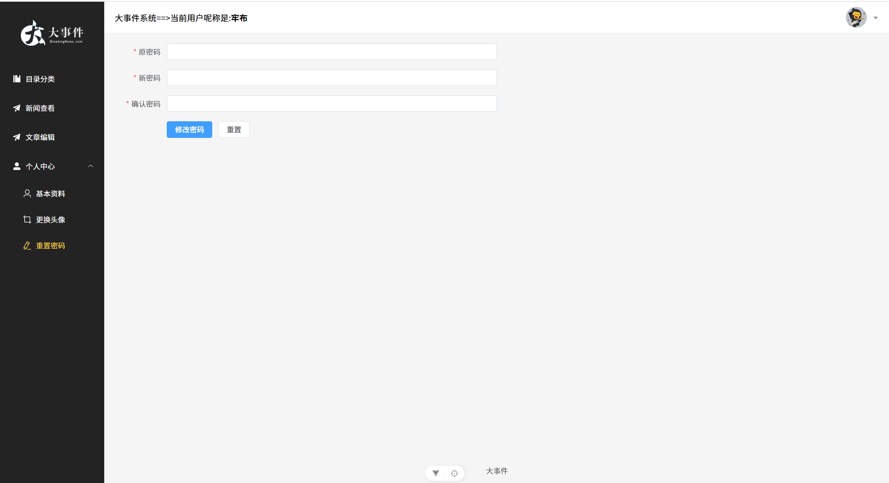
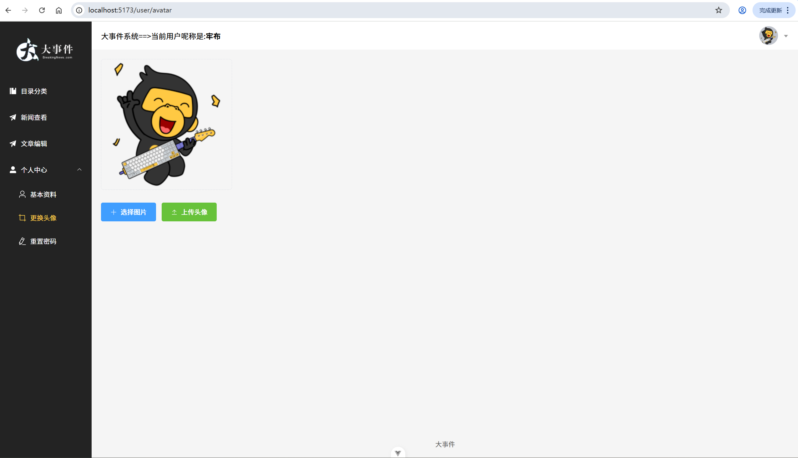
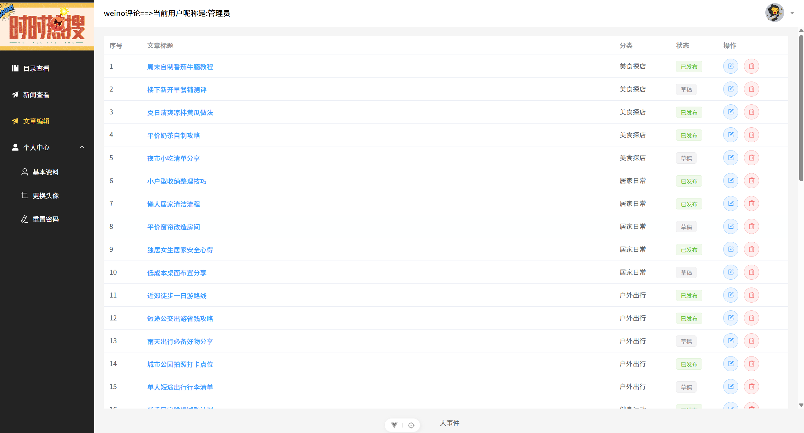
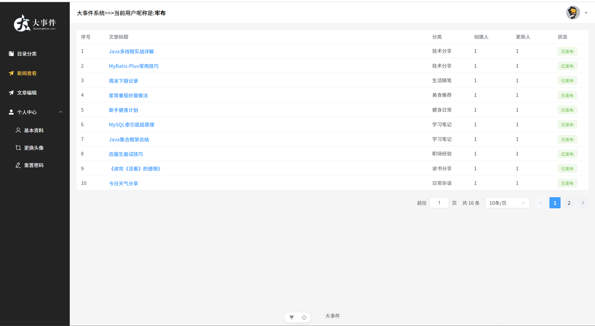
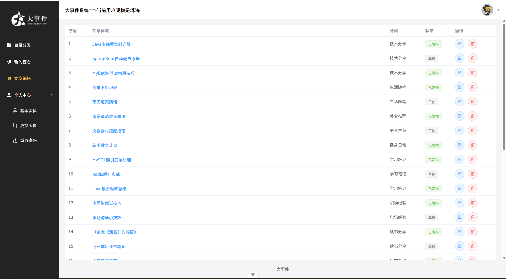

# Weibo-comment-platform 大众点评

基于 Spring Boot + Vue 3 的大众评论，使用redis+nginx的分布式系统，提供用户认证、文章管理、分类管理、优惠券秒杀等核心功能。

## 功能特性

- **用户管理**：用户注册、登录、个人信息修改、头像上传、密码修改
- **文章管理**：文章列表展示、发布文章、编辑文章、删除文章
- **分类管理**：分类创建、编辑、删除、列表展示
- **JWT认证**：基于Token的无状态认证机制
- **图片上传**：支持文章封面和用户头像上传（本地+阿里云OSS）
- **优惠券管理**：优惠券创建、秒杀券配置、订单管理
- **秒杀功能**：基于Redis的分布式ID生成器、并发库存扣减、一人一单限制
- **分布式锁**：基于Redis的分布式锁实现，使用Lua脚本保证原子性释放

## 后端依赖说明

### 用户管理功能依赖
| 依赖 | 版本 | 功能支撑 |
| :--- | :--- | :--- |
| Spring Boot | 3.3.8 | 应用框架，自动配置数据源、Redis等基础设施 |
| Spring Boot Starter Web | 3.3.8 | UserController提供REST接口（注册、登录、信息修改、头像上传、密码修改）；注册LoginInterceptor和ReLoginInterceptor拦截器校验登录状态 |
| MyBatis Plus | 3.5.9 | UserMapper继承BaseMapper实现用户数据CRUD；AutoMetaObjectHandler自动填充create_time、update_time等元数据字段 |
| JJWT API/Impl/Jackson | 0.12.6 | JwtUtil生成登录Token，ReLoginInterceptor验证Token并实现滑动过期策略（每次请求刷新Redis中Token有效期） |
| Spring Boot Starter Data Redis | 3.3.8 | 存储用户Token（`bigevent:{userId}`）和邮箱验证码（`code:{email}`，10分钟过期） |
| Spring Boot Starter Validation | 3.3.8 | @NotNull、@Size等注解校验注册和登录参数的合法性 |
| Aliyun SDK OSS | 3.17.4 | AliOssUtil实现用户头像上传到阿里云OSS，返回CDN访问URL |

### 事件文章管理功能依赖
| 依赖 | 版本 | 功能支撑 |
| :--- | :--- | :--- |
| MyBatis Plus | 3.5.9 | ArticleMapper实现文章数据CRUD；AutoMetaObjectHandler自动填充创建人ID和时间 |
| Spring Boot Starter Data Redis | 3.3.8 | **缓存策略**：ArticleServiceImpl使用分布式锁（`setIfAbsent`）+逻辑过期（RedisData包装类）防止缓存击穿；文章数据缓存10秒（逻辑过期）；更新/删除后主动删除缓存保证一致性 |
| Spring Boot Starter Validation | 3.3.8 | 自定义@ArticleStatus注解校验文章状态只能为"已发布"或"草稿" |
| Aliyun SDK OSS | 3.17.4 | 文章封面图片上传到阿里云OSS |
| Hutool All | 5.8.36 | BeanUtil进行缓存数据对象转换；StrUtil判空；JSONUtil序列化/反序列化Redis数据 |

### 分类管理功能依赖
| 依赖 | 版本 | 功能支撑 |
| :--- | :--- | :--- |
| MyBatis Plus | 3.5.9 | CategoryMapper实现分类数据CRUD；AutoMetaObjectHandler自动填充创建人ID和时间 |
| Spring Boot Starter Data Redis | 3.3.8 | **缓存策略**：CategoryServiceImpl使用分布式锁+逻辑过期防止缓存击穿；分类数据缓存10秒（逻辑过期）；更新/删除后主动删除缓存 |
| Spring Boot Starter Validation | 3.3.8 | @NotNull、@Size等注解校验分类名称和别名参数 |
| Hutool All | 5.8.36 | BeanUtil进行对象属性拷贝；StrUtil判空；JSONUtil序列化/反序列化 |

### 优惠券管理功能依赖
| 依赖 | 版本 | 功能支撑 |
| :--- | :--- | :--- |
| MyBatis Plus | 3.5.9 | VoucherMapper、VoucherSeckillMapper、VoucherOrderMapper实现优惠券数据CRUD；AutoMetaObjectHandler自动填充create_time、update_time等元数据字段 |
| Spring Boot Starter Data Redis | 3.3.8 | **分布式ID生成**：RedisID类基于Redis自增计数器实现全局唯一订单ID（时间戳31位+序号32位）；存储秒杀库存信息；**分布式锁**：RedisLock基于setIfAbsent实现锁获取，Lua脚本原子释放 |
| Spring Boot Starter Validation | 3.3.8 | 参数校验支持 |
| Spring Boot Starter Web | 3.3.8 | 提供@Transactional注解实现秒杀订单事务一致性（通过spring-tx传递依赖） |
| Hutool All | 5.8.36 | BeanUtil进行对象属性拷贝（VoucherDTO转Voucher）；UUID生成分布式锁唯一标识 |

### 核心组件说明

### 1. Redis分布式ID生成器（RedisID）
基于Redis自增计数器实现全局唯一ID，格式为：`时间戳(31位) + 序号(32位)`

```java
// 时间戳基准：2020-01-01 00:00:00 UTC
private final static long BEGIN_TIME = 1577836800L;
// 32位序号最大值
private static final long MAX_SEQ = 0xFFFFFFFFL;

// 生成ID逻辑
public long createId(String prefix) {
    // 获取当前时间戳偏移量
    long timestamp = nowSeconds - BEGIN_TIME;
    // 按日期生成自增序号
    String key = "icr:" + prefix + ":" + date;
    long count = stringRedisTemplate.opsForValue().increment(key);
    // 组合时间戳和序号
    return timestamp << 32 | count;
}
```

### 2. Redis分布式锁（RedisLock）
基于Redis实现的分布式锁，支持原子性释放，防止锁误删问题。

#### 锁获取机制
使用 `setIfAbsent`（NX模式）实现锁的获取，设置过期时间防止死锁：

```java
// KEY_PREFIX = "lock:"
// VALUE_PREFIX = UUID.randomUUID().toString() + ":"
Boolean success = stringRedisTemplate.opsForValue()
        .setIfAbsent(key, value, timeoutSec, TimeUnit.SECONDS);
```

#### 锁释放机制
使用Lua脚本保证原子性释放，只有锁的持有者才能释放锁：

```lua
-- redis-unlock.lua
local id = redis.call('get', KEYS[1])
if(id == ARGV[1]) then
    return redis.call('del', KEYS[1])
end
return 0
```

#### 接口定义（ILock）
```java
public interface ILock {
    boolean getLocked(long timeoutSec);  // 获取锁
    void unlook();                       // 释放锁
}
```

### 3. Redis缓存策略（RedisData）
使用逻辑过期策略防止缓存击穿，`RedisData`包装类封装数据和过期时间：

```java
// 缓存数据结构
class RedisData {
    private Object data;           // 业务数据
    private LocalDateTime expireTime;  // 逻辑过期时间
}
```

**缓存策略流程**：
1. 查询缓存，若不存在则查询数据库并设置逻辑过期时间
2. 若缓存存在但已过期，获取分布式锁后更新缓存
3. 更新/删除数据时主动删除缓存保证一致性

### 秒杀并发控制机制
| 机制 | 实现方式 | 功能说明 |
| :--- | :--- | :--- |
| **分布式ID** | RedisID.createId() | 基于Redis自增计数器生成64位唯一ID，格式：时间戳(31位) + 序号(32位) |
| **时间窗口校验** | LocalDateTime.now()比较 | 校验当前时间是否在秒杀活动开始时间(begin_time)和结束时间(end_time)之间 |
| **库存预校验** | voucherSeckill.getStock() > 0 | 下单前检查库存是否充足 |
| **JVM锁** | synchronized 方法修饰 | 单实例环境下防止并发，synchronized 锁粒度为方法级别，仅作用于当前JVM进程 |
| **分布式锁** | RedisLock.getLocked() | 基于Redis实现分布式锁，保证集群环境下的一人一单限制；key为 `lock:pay{userId}`，使用Lua脚本原子释放 |
| **一人一单校验** | LambdaQueryWrapper查询 | 在事务中基于用户ID和优惠券ID查询已存在订单 |
| **原子库存扣减** | lambdaUpdate.gt(stock, 0).setSql("stock = stock - 1") | 使用乐观锁，CAS操作保证库存扣减的原子性，防止超卖 |

### Redis分布式锁依赖

| 依赖                           | 版本   | 功能支撑                                                     |
| :----------------------------- | :----- | :----------------------------------------------------------- |
| Spring Boot Starter Data Redis | 3.3.8  | 提供Redis操作能力，实现分布式锁的获取（setIfAbsent）和Lua脚本执行 |
| Hutool All                     | 5.8.36 | UUID.randomUUID()生成锁的唯一标识，防止误删其他线程的锁      |

### 秒杀流程说明

秒杀逻辑位于 `VoucherController` 中，`payVoucher` 方法同时使用 **synchronized（JVM锁）+ RedisLock（分布式锁）** 双重锁机制，核心流程如下：

1. **创建优惠券**：通过 `POST /voucher/create` 接口创建优惠券及关联的秒杀活动配置

2. **用户下单**：通过 `POST /voucher/pay` 接口提交秒杀订单，方法使用 `synchronized` 修饰（单实例环境下的第一道防线）

3. **时间校验**：系统检查当前时间是否在秒杀活动的开始时间和结束时间范围内

4. **库存校验**：检查秒杀库存是否充足

5. **分布式锁获取**：使用 RedisLock 获取分布式锁（key为 `lock:pay{userId}`），保证集群环境下的一人一单限制（跨JVM进程的第二道防线）

6. **一人一单校验**：在事务中基于用户ID和优惠券ID查询已存在订单

7. **原子库存扣减**：使用 MyBatis Plus 的乐观锁 CAS 操作（`gt(stock, 0).setSql("stock = stock - 1")`）保证库存扣减的原子性，防止超卖

8. **订单创建**：库存扣减成功后，使用 RedisID 生成分布式唯一订单ID，保存订单记录

9. **锁释放**：使用Lua脚本原子性释放Redis分布式锁

10. **返回结果**：返回下单成功或失败信息

> **注意**：`synchronized` 仅作用于当前JVM进程，在集群部署环境下，需要依赖 RedisLock 保证跨节点的并发控制。

------

## 前端功能演示

### 登录页面


### 用户首页


### 文章列表


### 发布文章


### 分类管理


### 用户设置


## 项目结构

```
big_event/
├── backend-spring-bigevent/           # 后端代码（Spring Boot）
│   └── src/main/java/
│       ├── common/                    # 公共模块
│       │   ├── constant/              # 常量定义（JwtConstant）
│       │   ├── exception/             # 全局异常处理（GlobalExceptionHandler）
│       │   ├── properties/            # 配置属性（AliOssProperties、JwtProperties）
│       │   ├── result/                # 统一响应封装（Result）
│       │   └── util/                  # 工具类（AliOssUtil、JwtUtil、ThreadLocalContextHolder）
│       ├── mapper/                    # 数据访问层（UserMapper、ArticleMapper、CategoryMapper、VoucherMapper等）
│       ├── model/                     # 数据模型
│       │   ├── dto/                   # 数据传输对象（VoucherDTO）
│       │   └── entity/                # 实体类（User、Article、Category、Voucher、VoucherSeckill、VoucherOrder）
│       ├── service/                   # 业务逻辑层
│       │   ├── cache/                 # 缓存相关（RedisData缓存包装类）
│       │   ├── id/                    # ID生成服务（RedisID分布式ID生成器）
│       │   ├── impl/                  # 服务实现类
│       │   │   ├── ArticleServiceImpl.java      # 文章服务实现（含缓存策略）
│       │   │   ├── CategoryServiceImpl.java     # 分类服务实现（含缓存策略）
│       │   │   ├── UserServiceImpl.java         # 用户服务实现
│       │   │   ├── VoucherServiceImpl.java      # 优惠券服务实现
│       │   │   ├── VoucherSeckillServiceImpl.java # 秒杀优惠券服务实现
│       │   │   └── VoucherOrderServiceImpl.java # 优惠券订单服务实现
│       │   ├── lock/                  # 分布式锁服务
│       │   │   ├── ILock.java         # 锁接口定义
│       │   │   └── RedisLock.java     # Redis分布式锁实现
│       │   └── *.java                 # 服务接口定义
│       └── start/                     # 启动模块
│           ├── annotation/            # 自定义注解（ArticleStatus、ArticleStatusValidator）
│           ├── aspect/                # AOP切面（Info日志切面）
│           ├── config/                # 配置类（MybatisConfiguration、WebConfigConfiguration）
│           ├── controller/            # 控制层
│           │   ├── UserController.java       # 用户控制器
│           │   ├── ArticleController.java    # 文章控制器
│           │   ├── CategoryController.java   # 分类控制器
│           │   ├── VoucherController.java    # 优惠券控制器（含秒杀逻辑）
│           │   ├── FileController.java       # 文件上传控制器（本地）
│           │   └── FileOssController.java    # 文件上传控制器（阿里云OSS）
│           ├── handler/               # 处理器（AutoMetaObjectHandler自动填充）
│           ├── interceptor/           # 拦截器（LoginInterceptor、ReLoginInterceptor）
│           └── BigEventApplication.java  # 启动类
│   └── src/main/resources/            # 配置文件
│       ├── application.yml            # 主配置文件
│       ├── application-dev.yml        # 开发环境配置
│       ├── redis-unlock.lua           # Redis锁释放Lua脚本
│       └── smart-doc-postman.json     # API文档导出文件
├── database-sql/                      # 数据库脚本
│   └── sql.txt                        # 创建表语句
├── frontend-vue-bigevent/             # 前端代码（Vue 3）
│   └── src/
│       ├── api/                       # API接口（user.js、article.js、common.js）
│       ├── router/                    # 路由配置（index.js）
│       ├── stores/                    # 状态管理（modules/jwt.js、modules/user.js）
│       ├── utils/                     # 工具函数（request.js、format.js）
│       └── views/                     # 页面组件（login、user、article）
│   └── package.json
└── 说明/                              # 文档说明
    ├── 原型功能/                      # 功能演示图片
    ├── 并发测试/                      # 并发测试结果图片
    ├── 大事件接口文档.md               # API接口文档
    └── 测试文档.txt                   # 测试用例说明
```

## 环境要求
- JDK 17+
- springboot 3+
- Node.js 20.19.0+ 或 22.12.0+
- MySQL 8.0+
- Redis 7.0+